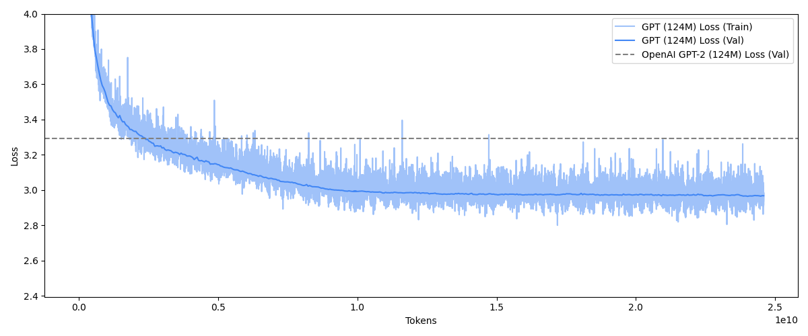
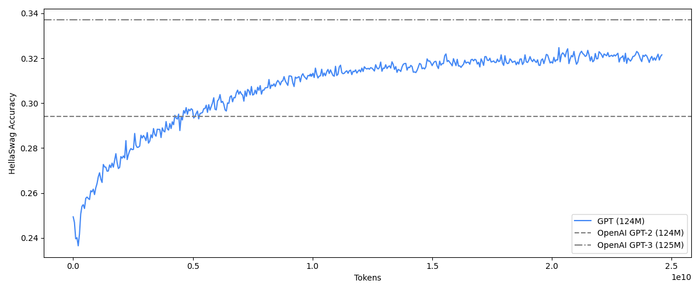

# GPT
A full implementation of a Generative Pre-trained Transformer (GPT) model following the architecture of OpenAI's [GPT-2](https://cdn.openai.com/better-language-models/language_models_are_unsupervised_multitask_learners.pdf) and [GPT-3](https://arxiv.org/abs/2005.14165) models as well as [nanoGPT](https://github.com/karpathy/nanoGPT) by Andrej Karpathy. The model is implemented in PyTorch and supports both single-GPU and multi-GPU training. The model is trained on the 10B token subset of [fineweb-edu](https://arxiv.org/pdf/2406.17557), a large-scale dataset of educational content.

The model surpasses GPT-2 124M on [HellaSwag](https://arxiv.org/pdf/1905.07830) after just 5B tokens. This is a 20x improvement over GPT-2 124M, which was trained on 100B tokens. It is expected that with enough training (~45B tokens), the model will surpass GPT-3 125M, which was trained on 300B tokens. Training the 124M model for 1 epoch of the 10B fineweb-edu subset took ~3 hours on 8x A100-SMX4 40GB GPUs. A batch size of 32 was used.




Here are some example completions from the 124M model after training on 25B tokens. The context is *`Once upon a time,'*. The completions are generated using the top-k sampling strategy with a maximum length of 64 tokens, a temperature of 1.0 and a k value of 50.

```
Once upon a time, the world of physics would not have been the same as it is today if these laws were different. The entire field of science is based upon these laws (the laws of mathematics), which are, in fact only a partial explanation of reality

Once upon a time, the Earth had six moons. These moons, they had in their formation in an internal "ring" which they had spun with the rotating Earth to form Mercury, the four of which orbited the Sun until they finally did return to the Earth in 1989.

Once upon a time, a person would need to know to do something right. This can lead to stress. People have developed an inbuilt habit in their lives to know the right way to act or behave in any situation. When it comes to things that they know it might 
```

## Installation and Usage
Run the following to install the GPT and its required dependencies:
```bash
git clone https://github.com/fraserlove/gpt.git
cd gpt
python -m venv .venv
source .venv/bin/activate
pip install -r requirements.txt
```

### Tokenisation
The `gpt2` tokeniser within the `tiktoken` library is used as the default tokeniser, however, a custom tokeniser is available within `gpt.tokeniser`. To train the custom tokeniser on the first 10,000 documents in the `fineweb-edu` dataset, run the following command:
```bash
python gpt/tokeniser.py
```
The custom tokeniser is saved as `gpt.tkn`. To use the custom tokeniser, replace `tiktoken.get_encoding('gpt2')` with `GPTTokeniser('gpt.tkn')` in `gpt/tokeniser.py`.
Note that the same tokeniser used when importing the `fineweb-edu` dataset must be used during training as otherwise the encodings will not match.

### Dataset
The fineweb-edu dataset is used as the dataset for training the GPT model as it is a large-scale, high quality dataset of educational content. By default, the `sample-10B` version of the dataset is used, which contains 10B tokens. The dataset is available on the Hugging Face Datasets Hub and can be downloaded using the `datasets` library. The dataset is tokenised and stored in shards in the `cache/fineweb_edu_10B` directory. To download the dataset and tokenise into shards, run the following command:
```bash
python fineweb.py
```
The dataset is loaded via the `gpt/dataloader.py` script. This script loads the dataset from the shards, shuffling the shards and also shuffling the documents within each shard. The script then concatenates the documents and loads them into batches.

### Training
The GPT model can be trained using the `train.py` script. The script supports both single-GPU and multi-GPU training using data parallelism. The model is trained using a custom training loop with a learning rate scheduler and gradient clipping as per GPT-3.

To run on a single GPU, use the following command:
```bash
python train.py
```

To run on multiple GPUs, use the following command:
```bash
torchrun --standalone --nproc_per_node={n_gpus} train.py
```
where `n_gpus` is the number of GPUs to use in training.

### Evaluation
[HellaSwag](https://arxiv.org/pdf/1905.07830) is used to evaluate the GPT model. To evaluate any GPT-2 model on the HellaSwag dataset, run the `hellaswag.py` script.

Analysis of the GPT model can be performed using the `eval.ipynb` notebook. The notebook contains code to plot the loss trajectory of the model, as well as the HellaSwag evaluation results.
